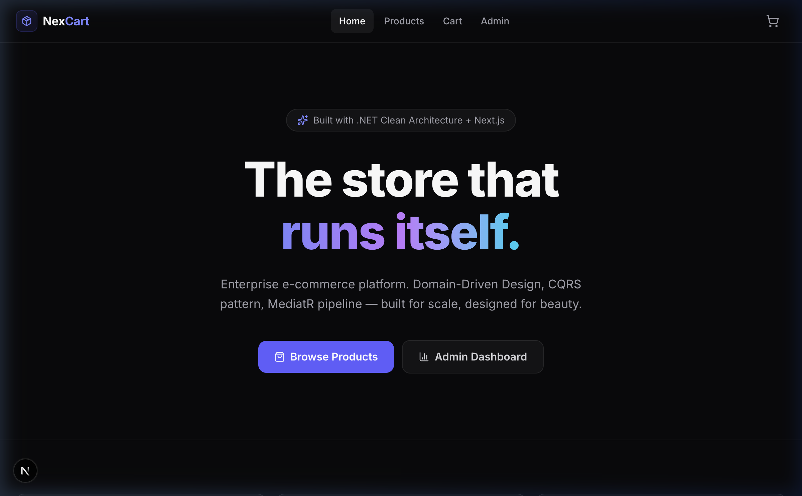
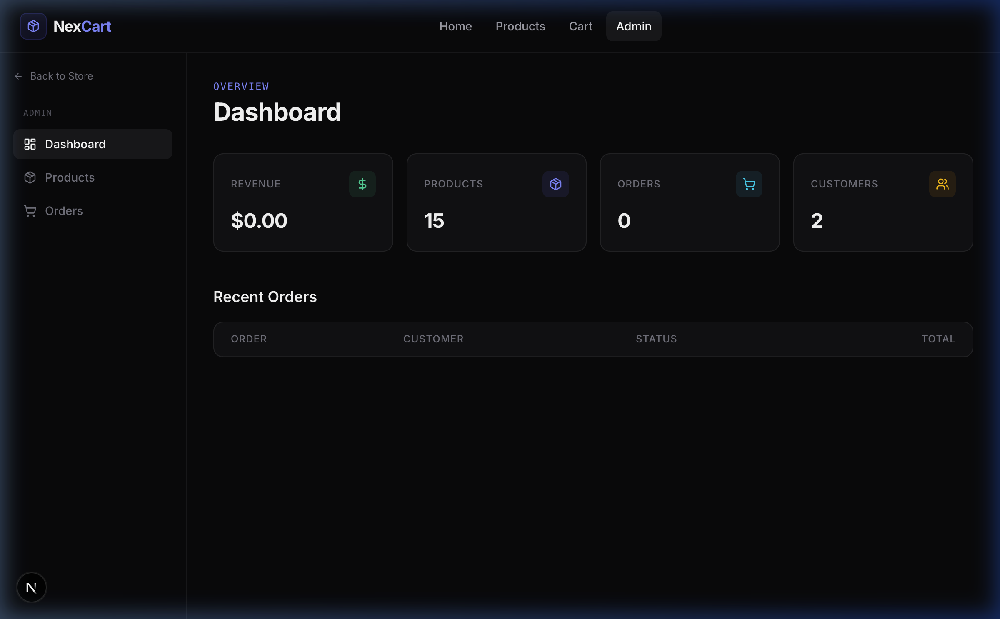

<p align="center">
  <h1 align="center">🛒 NexCart</h1>
  <p align="center">
    <b>Full-Stack E-Commerce Platform</b><br/>
    .NET 10 Clean Architecture API + Next.js 14 Storefront & Admin Dashboard
  </p>
  <p align="center">
    
    
    
    
    
    
  </p>
</p>

---

## Screenshots

### Storefront
<p align="center">
  
</p>

### Admin Dashboard
<p align="center">
  
</p>

### API Documentation (Scalar)
<p align="center">
  
</p>

---

## Tech Stack

| Layer | Tech |
|-------|------|
| **Backend** | .NET 10, EF Core, MediatR, FluentValidation, Serilog |
| **Frontend** | Next.js 14, TypeScript, Tailwind CSS, Zustand |
| **Database** | SQLite (dev) |
| **Patterns** | Clean Architecture, DDD, CQRS, Repository + Unit of Work |

---

## Quick Start

```bash
# Clone
git clone https://github.com/riyanmohmmeed-dev/NexCart.git
cd NexCart

# Run Backend (auto-seeds 15 products, 5 categories, 2 customers)
cd src/NexCart.API
dotnet run --urls "http://localhost:5119"

# Run Frontend (in a new terminal)
cd nexcart-web
npm install && npm run dev
```

| URL | What |
|-----|------|
| `http://localhost:3000` | Storefront |
| `http://localhost:3000/admin` | Admin Dashboard |
| `http://localhost:5119/scalar/v1` | API Docs |

---

## What's Inside

**Backend** — Products CRUD, Orders, Categories, Dashboard analytics, JWT auth infrastructure, auto-seeded SQLite database, Scalar API docs

**Frontend** — Home page, product catalog with search & filters, product detail with add-to-cart, shopping cart, admin dashboard with live stats, product management table, orders table with status badges

---

## API Endpoints

| Method | Endpoint | Description |
|--------|----------|-------------|
| `GET` | `/api/products` | Paginated products (search, filter, sort) |
| `GET` | `/api/products/{id}` | Product by ID |
| `POST` | `/api/products` | Create product |
| `PUT` | `/api/products/{id}` | Update product |
| `DELETE` | `/api/products/{id}` | Deactivate product |
| `GET` | `/api/orders` | Paginated orders |
| `POST` | `/api/orders` | Place order |
| `GET` | `/api/categories` | All categories |
| `GET` | `/api/dashboard/stats` | Analytics summary |

---

## License

MIT — see [LICENSE](LICENSE) for details.

<p align="center">
  Built by <a href="https://github.com/riyanmohmmeed-dev">Mohammed Riyan</a>
</p>
