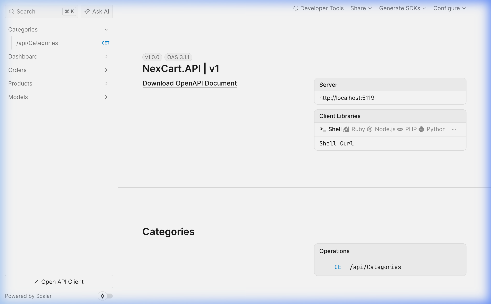
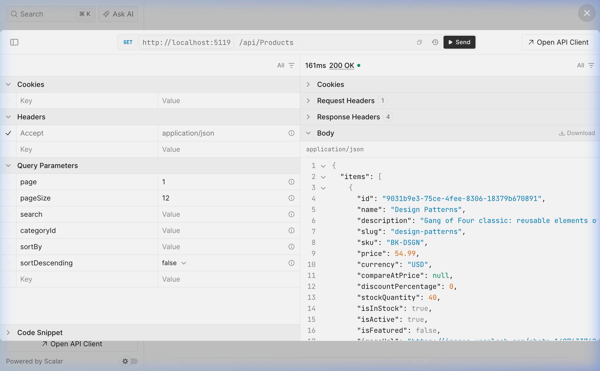
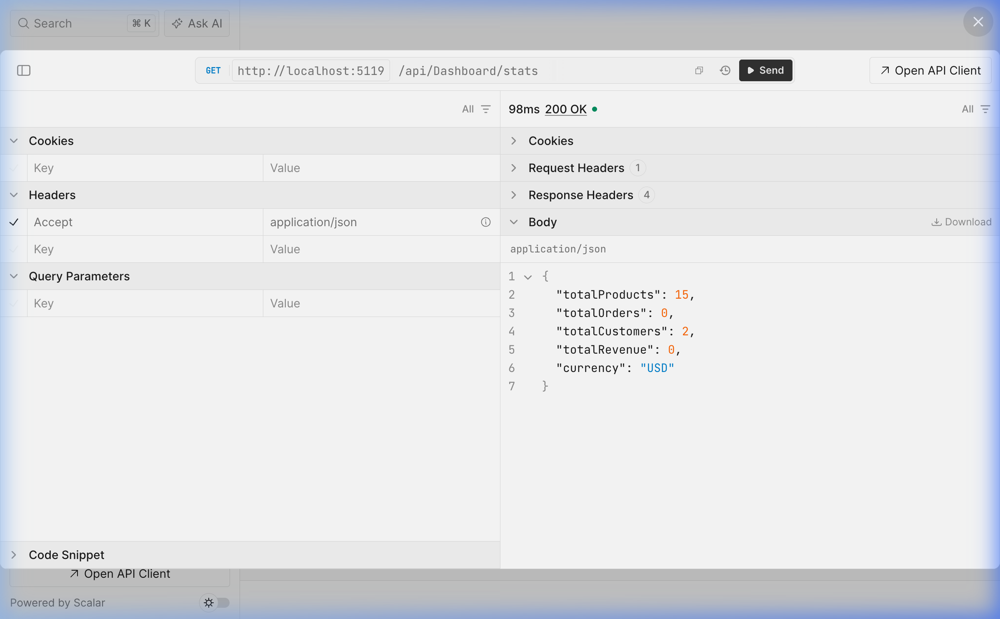
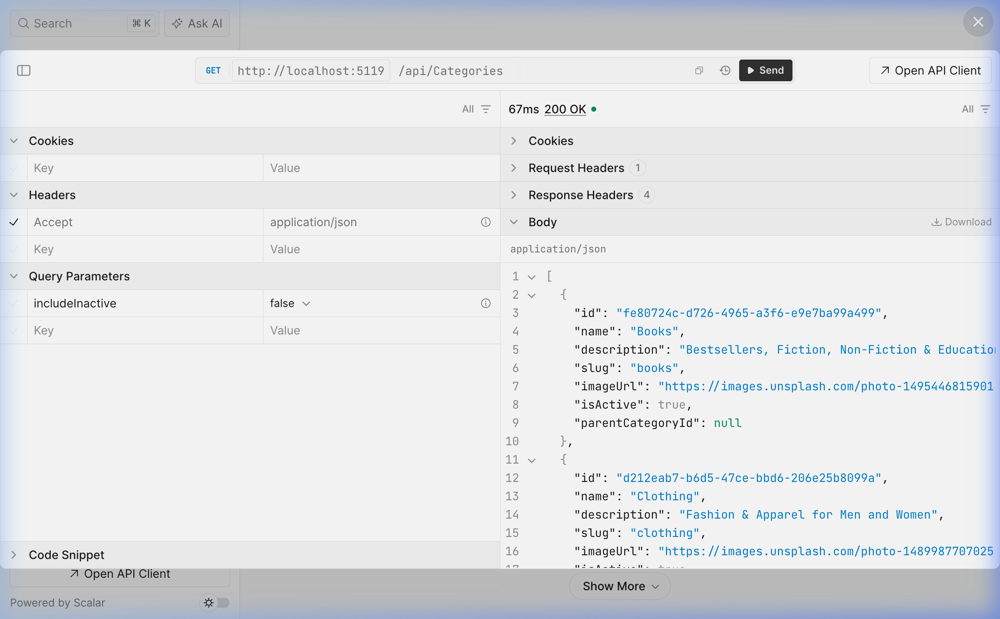
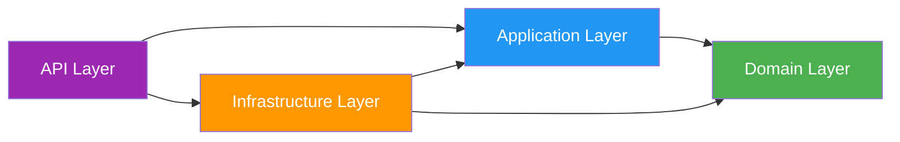

<p align="center">
  <h1 align="center">🛒 NexCart</h1>
  <p align="center">
    <b>Enterprise-Grade E-Commerce Platform</b><br/>
    Built with .NET 10 · Clean Architecture · Domain-Driven Design · CQRS
  </p>
  <p align="center">
    
    
    
    
    
    
  </p>
</p>

---

## 📖 About

**NexCart** is a production-ready, enterprise-grade e-commerce REST API showcasing advanced architectural patterns and industry best practices. Built with **.NET 10** and **Clean Architecture**, it demonstrates how to build scalable, maintainable, and testable backend systems using **Domain-Driven Design (DDD)** and **CQRS** with **MediatR**.

> This project serves as a portfolio-grade demonstration of building real-world enterprise applications — from rich domain modeling to automated validation pipelines.

---

## 🎬 Live Demo

### API Documentation (Scalar OpenAPI)
<p align="center">
  
</p>

### Products Endpoint — Paginated Response
<p align="center">
  
</p>

### Dashboard Analytics
<p align="center">
  
</p>

### Categories Endpoint
<p align="center">
  
</p>

---

## 🏗️ Architecture

```
NexCart/
├── src/
│   ├── NexCart.Domain/           # Core business logic (zero dependencies)
│   │   ├── Common/               # BaseEntity, AggregateRoot, IDomainEvent
│   │   ├── Entities/             # Product, Order, Customer, Category, Review, OrderItem
│   │   ├── ValueObjects/         # Money, Address, Email
│   │   ├── Enums/                # OrderStatus, PaymentStatus
│   │   ├── Events/               # ProductCreatedEvent, OrderPlacedEvent
│   │   └── Interfaces/           # Repository contracts & IUnitOfWork
│   │
│   ├── NexCart.Application/      # Use cases & orchestration
│   │   ├── Common/               # Result<T>, PagedResult, Behaviors, Interfaces
│   │   ├── Products/             # CRUD Commands & Queries with Validators
│   │   ├── Orders/               # PlaceOrder, GetOrders
│   │   └── Categories/           # GetCategories
│   │
│   ├── NexCart.Infrastructure/   # External concerns
│   │   ├── Persistence/          # EF Core DbContext, Fluent API, Repositories, Seed Data
│   │   └── Identity/             # JWT Token Service
│   │
│   └── NexCart.API/              # Presentation layer
│       ├── Controllers/          # ProductsController, OrdersController, CategoriesController, DashboardController
│       └── Middleware/            # Global Exception Handling (RFC 7807)
│
└── tests/
    ├── NexCart.Domain.Tests/
    └── NexCart.Application.Tests/
```

### Dependency Flow



> **Domain Layer** has **zero external dependencies** — pure C# business logic only.

---

## ✨ Key Features

### 🏛️ Architectural Patterns
| Pattern | Implementation |
|---------|---------------|
| **Clean Architecture** | 4-layer separation with strict dependency rules |
| **Domain-Driven Design** | Aggregate Roots, Value Objects, Domain Events, Rich Domain Models |
| **CQRS** | Separate Command and Query handlers via MediatR |
| **Repository + Unit of Work** | Transactional data access with EF Core |
| **Pipeline Behaviors** | Cross-cutting concerns (validation, logging) as middleware |

### 🛍️ Business Features
- **Product Catalog** — Full CRUD with search, pagination, sorting, filtering by category
- **Order Management** — Place orders with stock validation, price snapshots, state machine transitions
- **Customer Management** — Customer profiles with shipping/billing addresses
- **Category Hierarchy** — Self-referencing categories with subcategory support
- **Dashboard Analytics** — Real-time stats (products, orders, customers, revenue)
- **Discount Engine** — Compare-at pricing with automatic discount percentage calculation
- **Stock Management** — Low stock alerts, stock reduction/restoration

### 🔧 Technical Highlights
- **Value Objects** — `Money` (currency-safe arithmetic), `Address`, `Email` (regex-validated)
- **Domain Events** — `ProductCreatedEvent`, `OrderPlacedEvent` for event-driven architecture
- **FluentValidation** — Automatic request validation via MediatR pipeline
- **Serilog** — Structured logging with request timing
- **Scalar OpenAPI** — Beautiful, interactive API documentation
- **RFC 7807 ProblemDetails** — Standardized error responses
- **Auto-seeding** — 15 realistic products, 5 categories, 2 test customers

---

## 🚀 Getting Started

### Prerequisites
- [.NET 10 SDK](https://dotnet.microsoft.com/download/dotnet/10.0) or later

> No Docker, PostgreSQL, or any external databases required! The project uses **SQLite** for easy local development — just clone and run.

### Quick Start

```bash
# 1. Clone the repository
git clone https://github.com/riyanmohmmeed/NexCart.git
cd NexCart

# 2. Build the solution
dotnet build

# 3. Run the API
cd src/NexCart.API
dotnet run --urls "http://localhost:5119"
```

The API will:
- ✅ Auto-create the SQLite database
- ✅ Seed 15 products, 5 categories, and 2 customers
- ✅ Start serving at `http://localhost:5119`

### 🔗 Access Points

| Endpoint | URL |
|----------|-----|
| **API Documentation** | [http://localhost:5119/scalar/v1](http://localhost:5119/scalar/v1) |
| **Products** | [http://localhost:5119/api/products](http://localhost:5119/api/products) |
| **Categories** | [http://localhost:5119/api/categories](http://localhost:5119/api/categories) |
| **Dashboard** | [http://localhost:5119/api/dashboard/stats](http://localhost:5119/api/dashboard/stats) |
| **Orders** | [http://localhost:5119/api/orders](http://localhost:5119/api/orders) |
| **OpenAPI Spec** | [http://localhost:5119/openapi/v1.json](http://localhost:5119/openapi/v1.json) |

---

## 📡 API Endpoints

### Products
| Method | Endpoint | Description |
|--------|----------|-------------|
| `GET` | `/api/products` | Get paginated products (search, filter, sort) |
| `GET` | `/api/products/{id}` | Get product by ID |
| `POST` | `/api/products` | Create a new product |
| `PUT` | `/api/products/{id}` | Update a product |
| `DELETE` | `/api/products/{id}` | Soft-delete a product |

### Orders
| Method | Endpoint | Description |
|--------|----------|-------------|
| `GET` | `/api/orders` | Get paginated orders (filter by customer/status) |
| `POST` | `/api/orders` | Place a new order |

### Categories
| Method | Endpoint | Description |
|--------|----------|-------------|
| `GET` | `/api/categories` | Get all categories |

### Dashboard
| Method | Endpoint | Description |
|--------|----------|-------------|
| `GET` | `/api/dashboard/stats` | Get analytics summary |

### Example: Create Product
```bash
curl -X POST http://localhost:5119/api/products \
  -H "Content-Type: application/json" \
  -d '{
    "name": "Wireless Mouse",
    "description": "Ergonomic wireless mouse with USB-C receiver",
    "sku": "MSE-WRL",
    "price": 49.99,
    "stockQuantity": 100,
    "categoryId": "<category-id-from-get-categories>",
    "brand": "Logitech",
    "isFeatured": true
  }'
```

### Example: Place Order
```bash
curl -X POST http://localhost:5119/api/orders \
  -H "Content-Type: application/json" \
  -d '{
    "customerId": "<customer-id>",
    "street": "123 Main St",
    "city": "Mumbai",
    "state": "Maharashtra",
    "zipCode": "400001",
    "country": "India",
    "items": [
      { "productId": "<product-id>", "quantity": 2 }
    ]
  }'
```

---

## 🧰 Tech Stack

| Category | Technology |
|----------|-----------|
| **Runtime** | .NET 10 / ASP.NET Core |
| **ORM** | Entity Framework Core 10 |
| **Database** | SQLite (dev) / PostgreSQL (prod-ready) |
| **Mediator** | MediatR |
| **Validation** | FluentValidation |
| **Logging** | Serilog |
| **API Docs** | Scalar OpenAPI |
| **Auth** | JWT Bearer (infrastructure ready) |
| **Testing** | xUnit, Moq, FluentAssertions |

---

## 🗺️ Roadmap

- [x] **Phase 1** — .NET Clean Architecture Backend ✅
- [ ] **Phase 2** — Next.js 14 Storefront & Admin Dashboard
- [ ] **Phase 3** — Microservices with RabbitMQ (MassTransit)
- [ ] **Phase 4** — Docker, Kubernetes & CI/CD (GitHub Actions)

---

## 📝 License

This project is licensed under the MIT License — see the [LICENSE](LICENSE) file for details.

---

<p align="center">
  Built with ❤️ by <a href="https://github.com/riyanmohmmeed">Mohammed Riyan</a>
</p>
